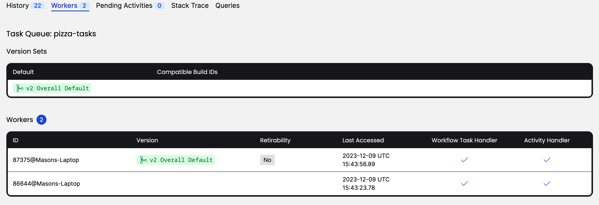

# Exercise 2: Version the Change with Worker Versioning

During this exercise, you will

- Define Worker Build ID Version Sets and enable Versioning on your Worker
- Make a change to your Workflow, and redeploy an updated Worker
- Ensure that your Workflows have switched to using the new code path
- Decommission an old Worker

If you are running this exercise locally with a Temporal Cluster that
you started via the `temporal server start-dev` command, you must
restart it using some additional parameters that will enable the
Worker Versioning feature:

```shell
temporal server start-dev \
   --dynamic-config-value frontend.workerVersioningDataAPIs=true \
   --dynamic-config-value frontend.workerVersioningWorkflowAPIs=true \
   --dynamic-config-value worker.buildIdScavengerEnabled=true
```

The above step is not necessary if you are using GitPod to run this
exercise.

Make your changes to the code in the `practice` subdirectory (look for
`TODO` comments that will guide you to where you should make changes to
the code). If you need a hint or want to verify your changes, look at
the complete version in the `solution` subdirectory.

## Part A: Assign a Build ID to Your Worker and Task Queue

Before enabling Worker Versioning, run this Workflow without making any further
modifications. Unlike our other exercises, the `practice` subdirectory contains
fully working example code.

1. Navigate to `exercises/patch-versioning/practice` by running
   `cd exercises/patch-versioning/practice`
   1. If you're in the GitPod environment you can run the shortcut command `ex1`
1. Launch the Worker in one terminal by running the command `mvn exec:java -Dexec.mainClass="pizzaworkflow.PizzaWorker"`
   1. If you're in the GitPod environment you can run the shortcut command `ex1w`
1. Start the Workflow in another terminal by running the command `mvn exec:java -Dexec.mainClass="pizzaworkflow.Starter"`
   1. If you're in the GitPod environment you can run the shortcut command `ex1st`
1. This creates an environment where an unverioned Worker is already running.
1. Edit the `PizzaWorker.java` file to add a Build ID to your Worker and opt in
   to Worker Versioning.

   1. Add the following code to specify `WorkerOptions` for you worker, specifying
      the `BuildID` as `v2` and enabling versioning by setting `UseBuildIdForVersioning` to `true`
      ```java
      WorkerOptions workerOptions = WorkerOptions.newBuilder()
         .setBuildId("v2")
         .setUseBuildIdForVersioning(true)
         .build();
      ```
   1. **Note:** This code would usually only need to be run once. In a production system you would not run this as part of your client, but more likely as part of your build system on initial deployment, either via the SDK or the Command Line Tool

1. Edit the `Stater.java` to inform the Task Queue about your Worker's Build ID before starting your Workflow.
   ```java
   client.updateWorkerBuildIdCompatability(Constants.TASK_QUEUE_NAME,
        BuildIdOperation.newIdInNewDefaultSet("v2"));
   ```
1. Run a new version of your worker by running `mvn exec:java -Dexec.mainClass="pizzaworkflow.PizzaWorker"`
   in a new terminal window.
   1. If you're in the GitPod environment you can run the shortcut command `ex1w`
   1. **Note**: You do not need to terminate your old worker. If you execute
      your Workflow again by running `mvn exec:java -Dexec.mainClass="pizzaworkflow.Starter"`
      (or `ex1st` if in GitPod) again, you should see some output from the
      terminal window of your new worker. This indicates that the Workflow was
      chosen and run by the new, versioned worker, and the unversioned worker ignored
      it.
1. To retrieve the information about build IDs from the CLI, run
   `temporal task-queue get-build-ids --task-queue pizza-tasks`. You
   should see output similar to this:
   ```output
         BuildIds        DefaultForSet   IsDefaultSet
     [revision-yymmdd]  revision-yymmdd  true
   ```

## Part B: Decommission Your Old Worker

1. Now that you have a new, versioned Worker running, you probably
   aren't planning on submitting any more Workflows to your old,
   unversioned Worker. However, it's important to make sure that your
   old Worker isn't still handling any Workflows -- and that it has
   a ready replacement -- before decommissioning it. There are a
   few ways of verifying this, using the CLI and the Web UI. The
   "Retirability" field you saw in the last step is one.
1. Run `temporal task-queue describe --task-queue pizza-tasks`. Both
   of your running Workers should report in, as they are continuing to
   poll despite not receiving any more Workflow Execution requests:
   ```output
        Identity        LastAccessTime  RatePerSecond
   86644@Masons-Laptop  25 seconds ago         100000
   87375@Masons-Laptop  51 seconds ago         100000
   ```
1. Run `temporal task-queue get-build-id-reachability -t pizza-tasks --build-id v2`.
   This will return information about which whether your new Build ID is
   available and accepting both New and Existing Workflows:

   ```output
   BuildId   TaskQueue            Reachability
   v2       pizza-tasks  [NewWorkflows
                           ExistingWorkflows]
   ```

   You can also verify this by visiting the Web UI again. Examine
   the `pizza-tasks` Task Queue or the "Workers" UI tab to
   see the registered Workers and their versions. You should notice
   a "Retirability" field indicating which of your Workers that you
   are able to safely retire, as they are no longer registered as a
   default or handling any existing Workflows:

   

   **Note:** If you do not see this in the UI, you may need to update to a newer
   version of the UI.

1. Once you have verified that you old version has no more Workflows to be executed
   you can decommission the Worker using `Ctrl-C`.

## Part C: Add Another Worker Using Version Sets

Lastly, you'll experiment with Version Sets using the CLI rather than the SDK.
In Part A, you used `client.UpdateWorkerBuildIdCompatibility()` to update your Task
Queue with new a Worker Version. You can accomplish the same thing by running
`temporal task-queue update-build-ids` with matching parameters.

1. Assume you are adding another new Worker Version that is compatible with the
   Version that you added in Part A. To do this, run:

   ```shell
   temporal task-queue update-build-ids add-new-compatible \
      --build-id="v2.1" \
      --existing-compatible-build-id="v2" \
      --task-queue="pizza-tasks"
   ```

   This will add `v2.1` as another compatible Build ID to the same
   Task Queue. This is equivalent to running the following SDK code:

   ```go
   client.updateWorkerBuildIdCompatability(Constants.TASK_QUEUE_NAME,
        BuildIdOperation.newCompatibleVersion("v2.1", "v2"));
   ```

   In practice, you should find this at least as useful as updating your
   Task Queues from the SDK.

2. Lastly, you can now deploy a new Worker, identified by this new Build ID,
   and it will be able to process the same Workflows. Although you would
   ordinarily do this when making code changes, you can do it without changing
   anything for the sake of this example.
   1. Terminate your `v2` Worker by using `Ctrl-C`
   1. Update the `BuildID` field from your ` WorkerOptions` declaration to
      reflect the new `v2.1` Version, recompile the Worker and restart your Worker
      once again.
   1. Re-run your Workflow starter. You should observe that the new `v2` Worker
      executed the Workflow, demonstrating that both versions within the Version
      Set are compatible.

### This is the end of the exercise.
